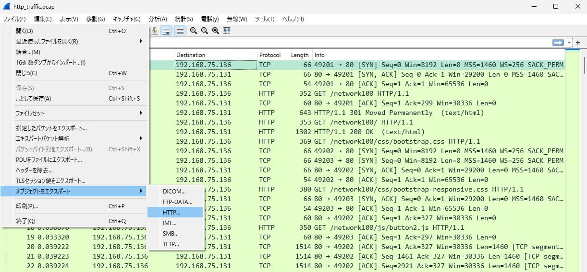

#### [Stego]隠されたフラグ

画像をダウンロードし拡大してみると画像の端にモールス信号が書かれており、これを翻訳したものがフラグになる。

#### [Web] Redirect

HTTPヘッダを確認する。

```bash
$ curl -I http://q15.ctf.cpaw.site
```

302でリダイレクトされていることがわかる。
ついでにフラグもわかる。

#### [Network+Forensic]HTTP Traffic

1. ダウンロードしたpcapファイルをWiresharkで開く
1. ファイル [label](https://ctf.cpaw.site/index.php)> オブジェクトをエクスポート > HTTP
    
1. すべて保存し、適切なディレクトリにファイルを配置する
1. ブラウザで保存したページを開き、ボタンを押すとフラグを得られる


#### [Recon]Who am I ?

Twitterアカウントを検索する。

#### [Forensic]leaf in forest

ダウンロードしたファイルを`file`コマンドで調べると、pcap capture fileであることが分かるので、Wiresharkで読み込んでみるがうまく開けない。

バイナリエディタでファイルを開いて眺めていると、大量の`lovelive!`とその中に怪しい文字列が含まれていることが分かる。

目grepするか、文字列置換などしてフラグを抽出。

今回は`lovelive!`を空白に置換して残った文字列から拾ってフラグを取得。
もっとスマートな方法があるかもしれないけどわからない。

#### [Misc]Image!

ダウンロードしたzipをとりあえず解凍して中身をみてみるとLibreOfficeのファイルっぽいことがわかる。

LibreOfficeをインストールし、`misc 100.zip`をLibreOffice Writerで表示。

邪魔な四角のオブジェクトを取り除くとフラグを得られる。

#### [Crypto]Block Cipher

```c
#include <stdio.h>
#include <stdlib.h>
#include <string.h>
int main(int argc, char* argv[]){
  int i;
  int j;
  int key = atoi(argv[2]);
  const char* flag = argv[1];
  printf("cpaw{");
  for(i = key - 1; i <= strlen(flag); i+=key) for(j = i; j>= i - key + 1; j--) printf("%c", flag[j]);
  printf("}");
  return 0;
}
```

- 実行時に引数を2つ受け取りそう
  - ./a.out $flag $key
    - flagは文字列でkeyは数字っぽい
- printf()に挟まれるループ文の中でフラグの文字列を生成してそう

```c
for(i = key - 1; i <= strlen(flag); i+=key)
  for(j = i; j>= i - key + 1; j--)
    printf("%c", flag[j]);
```

keyに与えられた値で文字列を区切って、その文字列を後ろから1文字ずつ出力する処理をしている。

具体例
`$ ./a.out ABCD 2`のようにプログラムを実行したとする。

文字列ABCDを2文字ずつに区切ると、"AB", "CD"となる。
それぞれを後ろから一文字ずつ出力すると、"BA", "DC"となる。

今回の問題では、key=4で実行するとフラグを得ることができる。

#### [Reversing]reversing easy!


#### [Web]Baby's SQLi - Stage 1-

```sql
select * from palloc_home
```

#### [Network] Can you login？

1. pcapファイルを開き、ftpでフィルタするとftpサーバのusernameとpasswordが見える。
1. `ftp`コマンドでftpサーバらしきものに接続
  ```bash
  $ ftp xxx.xxx.xxx.xxx
  ftp> passive
  ftp> pwd
  ftp> dir -a
  ftp> get ${FLAG_FILE}
  ```
